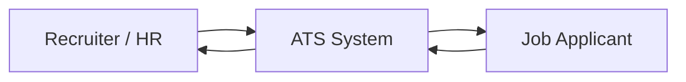
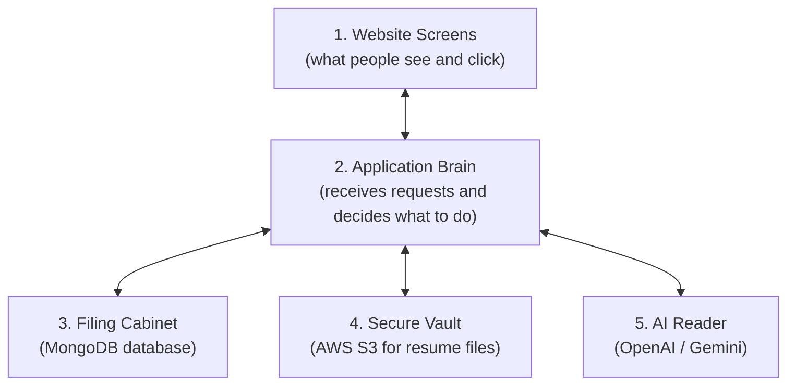
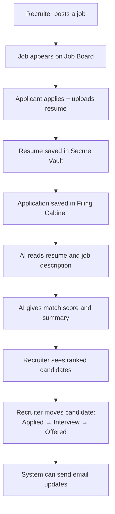
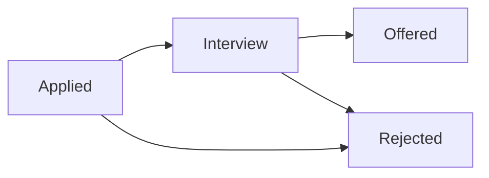
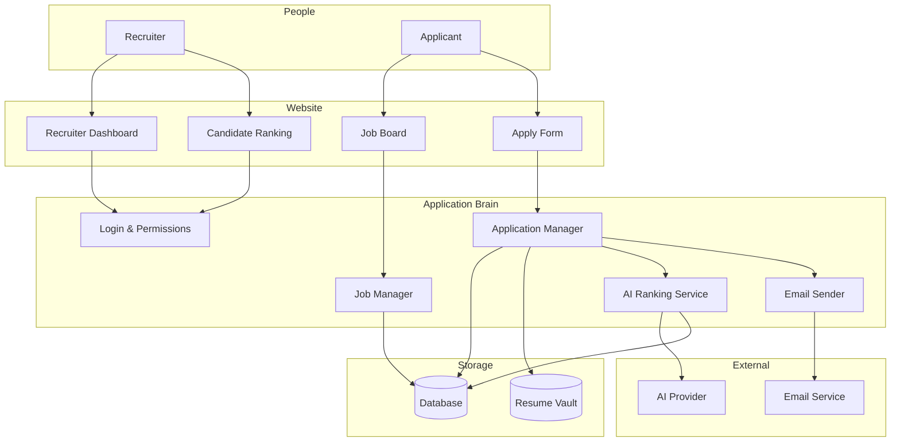

# System Design — Simple Guide (Non-Technical)

This document explains **how the AI Applicant Tracking System works** using everyday language.  
No coding knowledge needed.

---

## 1. What is this system?

Think of it like a **smart hiring office**:

- Companies post job openings  
- People apply and upload their resume  
- The system stores everything safely  
- AI reads the resume and says how good a match the person is  
- HR moves candidates through hiring stages  

**In one sentence:**  
It helps companies find the right candidates faster, with less manual resume reading.

---

## 2. Who uses it?

| Person | What they do |
|--------|----------------|
| **Recruiter (HR)** | Posts jobs, reviews applications, moves people to Interview/Offer |
| **Applicant** | Sees jobs, applies, uploads resume, tracks status |
| **AI Assistant (inside system)** | Reads resumes and ranks candidates |

---

## 3. Big picture — the building blocks

Imagine 5 rooms in one office building:

### What each part means

| Part | Simple meaning | Real name |
|------|----------------|-----------|
| Website screens | Buttons, forms, dashboards | Frontend (React) |
| Application brain | Rules and workflow logic | Backend (Node.js) |
| Filing cabinet | Saves names, jobs, scores, status | MongoDB |
| Secure vault | Saves PDF resume files | AWS S3 |
| AI reader | Understands resume vs job | OpenAI / Gemini |

---

## 4. How hiring flows through the system

---

## 5. Simple journey examples

### Journey A — Recruiter posts a job

1. Recruiter logs in  
2. Fills job title, description, required skills  
3. Clicks Save  
4. Job becomes visible to applicants  

### Journey B — Applicant applies

1. Applicant opens Job Board  
2. Chooses a job  
3. Uploads resume (PDF)  
4. Gets confirmation: “Application submitted”  
5. Later can check status (Applied / Interview / Offered)

### Journey C — AI helps shortlist

1. System extracts text from resume  
2. AI compares resume meaning with job needs  
3. Creates a score (example: 86/100)  
4. Lists matching skills and missing skills  
5. Recruiter sorts by highest score first  

---

## 6. The hiring pipeline (Kanban)

Like moving sticky notes across a board:

| Stage | Meaning |
|-------|---------|
| **Applied** | Just applied; waiting for review |
| **Interview** | Selected for interview |
| **Offered** | Got a job offer |
| **Rejected** | Not moving forward |

---

## 7. Why files and data are separated

| Stored in Filing Cabinet (Database) | Stored in Secure Vault (S3) |
|-------------------------------------|-----------------------------|
| Candidate name, email | The actual resume PDF |
| Job title and description | |
| Application status | |
| AI score and summary | |

**Why?**  
Keeping big files in a vault is safer and cleaner — like keeping papers in a locked cupboard, and keeping a register book of who applied.

---

## 8. System design model (one diagram)

---

## 9. What “AI ranking” means (simple)

AI does **not** hire people.  
It only helps with the **first screening**.

Example:

- Job needs: React, Node.js, MongoDB  
- Resume shows: strong React + Node.js, weak MongoDB  
- AI result:
  - Score: **82/100**
  - Matched: React, Node.js  
  - Missing: MongoDB  
  - Short note for HR  

This is called **semantic matching** = matching by meaning, not only exact words.

---

## 10. Safety in plain words

| Protection | Simple explanation |
|------------|--------------------|
| Login | Only the right people enter |
| Roles | Applicants and recruiters see different screens |
| Private resumes | Resume files are not public on the internet |
| Temporary links | HR gets a short-time link to open a resume |
| No guessing access | One company cannot see another company’s applicants |

---

## 11. 4-week build story (non-technical)

| Week | What gets ready |
|------|-----------------|
| **Week 1** | Login + post jobs + job board |
| **Week 2** | Apply with resume + status board |
| **Week 3** | AI reading and scoring |
| **Week 4** | Filters, emails, final testing & launch |

---

## 12. Bottom line

This system is a **digital hiring workspace** with three superpowers:

1. **Organize** jobs and applications  
2. **Protect** resume files  
3. **Assist** HR with AI shortlisting  

Human recruiters still make final decisions.
