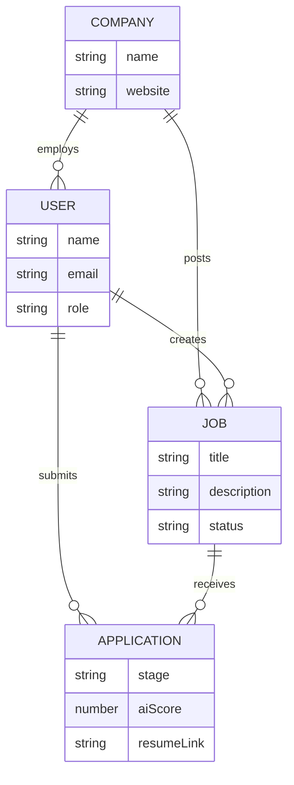
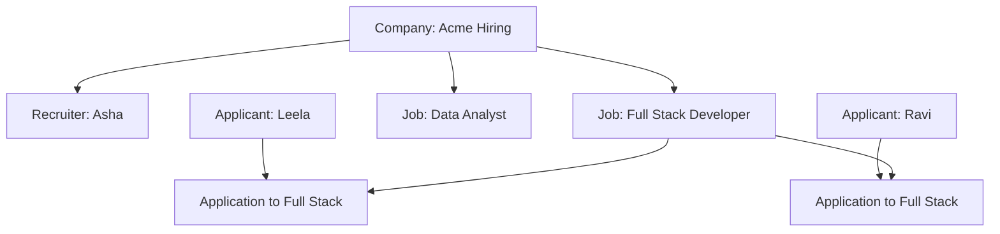
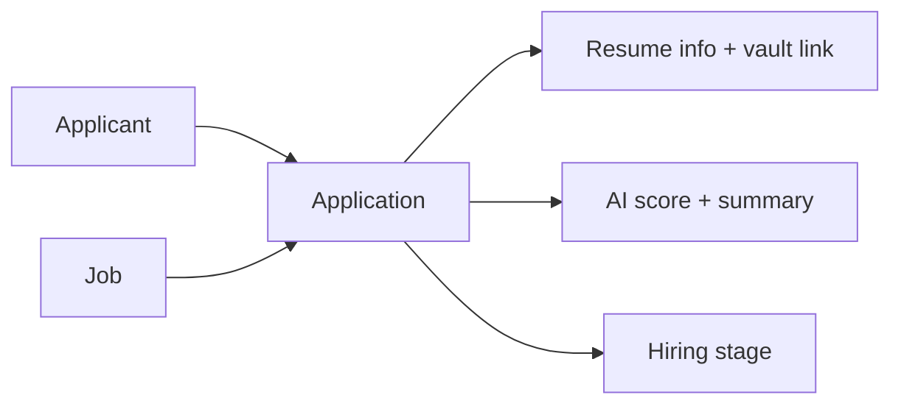
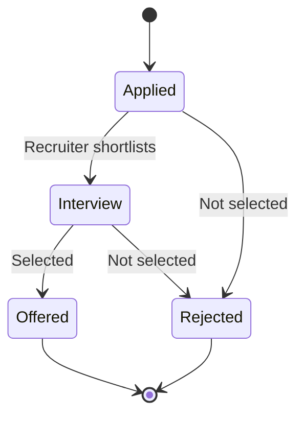
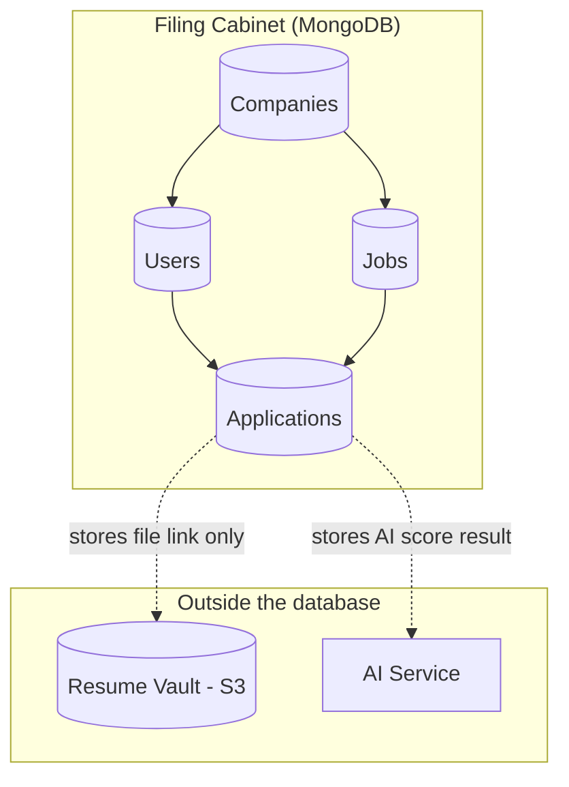

# Database Model — Simple Guide (Non-Technical)

This document explains **how information is organized** in the system.  
Think of the database as a **set of labeled registers/files**, not as computer code.

---

## 1. What is a database here?

A database is the system’s **memory**.

It remembers:

- Who registered  
- Which jobs were posted  
- Who applied  
- What stage each person is in  
- What the AI said about each candidate  

Resume PDF files are stored separately in a **secure vault (S3)**.  
The database stores the **details and the link** to that file.

---

## 2. The main “registers” (tables/collections)

We keep 4 main registers:

| Register | Everyday meaning |
|----------|------------------|
| **Company** | The hiring organization |
| **User** | A person account (Recruiter or Applicant) |
| **Job** | A job opening |
| **Application** | One person applying to one job |

---

## 3. How they connect (family tree)

### Simple rules

1. One **company** can have many recruiters and many jobs.  
2. One **applicant** can apply to many jobs.  
3. For one job, one applicant can apply **only once**.  
4. Every application belongs to **exactly one job** and **one applicant**.

---

## 4. Company register

**What it stores**

- Company name  
- Website (optional)

**Why needed**  
So jobs and applications are grouped under the correct organization.  
Company A never sees Company B’s candidates.

---

## 5. User register

Each user has a **role**:

| Role | Like being… |
|------|-------------|
| **Recruiter** | Office hiring manager |
| **Applicant** | Job seeker |

**What it stores**

- Name  
- Email  
- Password (saved in locked/encrypted form)  
- Role  
- Linked company (for recruiters)

---

## 6. Job register

**What it stores**

- Job title  
- Full job description  
- Required skills (example: React, MongoDB)  
- Experience needed  
- Location / work type  
- Status: Open or Archived  

| Status | Meaning |
|--------|---------|
| **Open** | Visible on Job Board; people can apply |
| **Archived** | Closed/old; hidden from public board |

**Important:**  
The job description is what AI uses for matching.

---

## 7. Application register (most important)

An application is the **bridge** between a person and a job.

### What one application contains

| Section | Simple contents |
|---------|-----------------|
| **Links** | Which applicant + which job |
| **Stage** | Applied / Interview / Offered / Rejected |
| **Resume info** | File name + secure vault location |
| **AI status** | Waiting / Done / Failed |
| **AI result** | Score, matched skills, missing skills, short summary |
| **History** | Record of stage changes |

---

## 8. Application stages (status meanings)

---

## 9. Example in plain English

### Company
Acme Hiring

### Users
- Asha (Recruiter at Acme)  
- Leela (Applicant)

### Job
Full Stack Developer  
Needed skills: React, Node.js, MongoDB

### Application
Leela applied to Full Stack Developer

- Stage: **Interview**  
- AI Score: **86/100**  
- Matched skills: React, Node.js  
- Missing: MongoDB  
- Resume stored in vault under a private code/link  

---

## 10. Database architecture model (easy view)

### Remember

- Database = facts and status  
- Vault = actual resume documents  
- AI = creates the score, then score is saved into Application  

---

## 11. Why this design is good (business view)

| Benefit | Explanation |
|---------|-------------|
| **Clear ownership** | Every job/application belongs to one company |
| **No duplicate chaos** | Same person can’t apply twice to same job |
| **Fast shortlisting** | AI score sits on each application |
| **Trackable hiring** | Stage history shows what happened |
| **Safer resumes** | Files not dumped inside the main register |

---

## 12. What HR sees vs what is stored

| HR sees on screen | Comes from |
|-------------------|------------|
| Job list | Jobs register |
| Candidate name/email | Users register |
| Match score | Application → AI result |
| Pipeline column | Application → stage |
| Open resume button | Application → vault link (temporary secure open) |

---

## 13. Tiny glossary

| Word | Simple meaning |
|------|----------------|
| **Database** | System memory / filing cabinet |
| **Collection / Table** | One type of register |
| **Record / Document** | One row, like one job or one application |
| **Relation / Link** | How registers point to each other |
| **S3 / Vault** | Secure place for resume files |
| **AI Score** | Number showing job fit (0–100) |

---

## 14. Bottom line

The database model is built around **four registers**:

1. **Company** — who is hiring  
2. **User** — recruiters and applicants  
3. **Job** — what role is open  
4. **Application** — who applied, current stage, AI result, resume link  

Everything else in the product is just a friendly screen on top of this structure.
