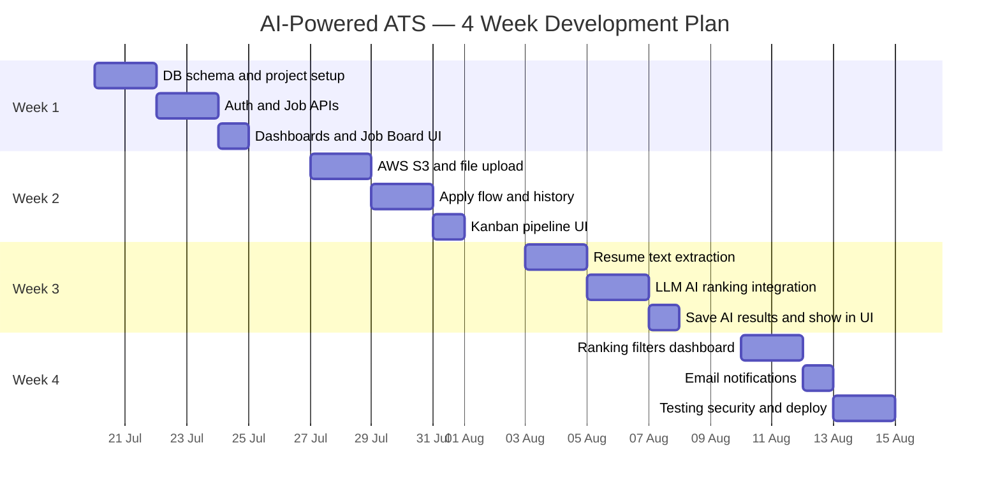

# Development Timeline — 4 Weeks × 5 Working Days

**Schedule type:** Monday–Friday only (weekends off)  
**Total working days:** 20 days  
**Daily work assumption:** ~6–8 hours focused development  

This plan maps the full ATS project into a clear calendar for developers and managers.

---

## Calendar Overview

> Dates above are **example start dates**. Shift the whole plan to your real start Monday.

---

## At-a-Glance (Manager View)

| Week | Theme | Main Outcome by Friday |
|------|--------|-------------------------|
| **Week 1** | Portals & Jobs | Login works; jobs can be posted; public job board live |
| **Week 2** | Applications & Files | Candidates apply with resume; HR moves pipeline stages |
| **Week 3** | AI Ranking | Resumes parsed; AI match score visible |
| **Week 4** | Filters, Email, Launch | Ranking filters + emails + deployed app |

---

## Work Rules

| Rule | Detail |
|------|--------|
| Working days | Mon, Tue, Wed, Thu, Fri |
| Off | Sat, Sun |
| Daily standup suggestion | 10–15 min: Done / Today / Blockers |
| End of each day | Commit working code + short note of progress |
| End of each week (Fri) | Demo + checklist sign-off |
| If blocked | Move non-critical UI polish to Friday buffer time |

---

# WEEK 1 — Portals & Job Management

**Goal:** People can register/login, recruiters manage jobs, public can view jobs.

| Day | Focus | Tasks | Done when |
|-----|--------|-------|-----------|
| **Mon (Day 1)** | Project + DB start | Create `server` app; connect MongoDB; health API; start Company/User/Job models | Server runs; DB connected |
| **Tue (Day 2)** | Finish schema + seed | Complete models + indexes; Application stub; seed demo recruiter/applicant/jobs | Seed data loads successfully |
| **Wed (Day 3)** | Auth APIs | Register applicant; register recruiter; login; JWT; `/me` | Both roles can login and get profile |
| **Thu (Day 4)** | Job APIs | Create/edit/archive job; public job list; recruiter job list; ownership checks | Recruiter posts job via API |
| **Fri (Day 5)** | Frontend Week-1 UI | React app + MUI; login/register pages; Job Board; Recruiter Dashboard; Job Form | E2E: register → create job → see on board |

### Week 1 Friday Demo Checklist

- [ ] Recruiter signup/login  
- [ ] Applicant signup/login  
- [ ] Create / edit / archive job  
- [ ] Public job board shows open jobs  

### Week 1 Deliverables

- Auth system  
- Job management APIs  
- Recruiter dashboard + public board  

---

# WEEK 2 — Application Pipeline & File Storage

**Goal:** Applicants upload resumes; files stored safely; HR manages hiring stages.

| Day | Focus | Tasks | Done when |
|-----|--------|-------|-----------|
| **Mon (Day 6)** | AWS S3 setup | Create bucket; IAM keys; private access; env config; S3 upload service | Test file appears in S3 |
| **Tue (Day 7)** | Multer upload API | File validation (PDF/DOCX, size); upload middleware; signed download URL | API accepts resume and returns safe link for recruiter |
| **Wed (Day 8)** | Apply API | Submit application with resume; one-apply-per-job rule; save metadata | Applicant can apply once per job |
| **Thu (Day 9)** | Applicant UI + history | Apply form page; My Applications list; status chips | Candidate sees own applications |
| **Fri (Day 10)** | Kanban pipeline | Status update API; stage history; recruiter board Applied → Interview → Offered | Stage change persists after refresh |

### Week 2 Friday Demo Checklist

- [ ] Upload PDF resume to S3  
- [ ] Apply to open job  
- [ ] Duplicate apply blocked  
- [ ] Move candidate to Interview on Kanban  

### Week 2 Deliverables

- Secure resume storage  
- Application submit + history  
- Recruiter pipeline board  

---

# WEEK 3 — AI Integration & Resume Parsing

**Goal:** System reads resumes and ranks candidates against each job.

| Day | Focus | Tasks | Done when |
|-----|--------|-------|-----------|
| **Mon (Day 11)** | PDF text extract | Integrate pdf-parse; extract text after upload; handle empty PDF errors | Sample PDF text saved on application |
| **Tue (Day 12)** | DOCX + cleanup | DOCX parsing; truncate long text; AI status = pending/processing/failed | Non-PDF resumes also extract (or clear failure message) |
| **Wed (Day 13)** | LLM integration | Connect OpenAI or Gemini; write match prompt; parse JSON score/skills/summary | AI returns valid score object in test |
| **Thu (Day 14)** | Async analyze + save | Run analysis after apply; save `aiAnalysis` in MongoDB; retry/failed states | New apply becomes AI completed with score |
| **Fri (Day 15)** | Show AI in UI | Score badge; summary on recruiter views; polling while pending; reanalyze button | Recruiter sees score without refreshing forever |

### Week 3 Friday Demo Checklist

- [ ] Apply with resume → AI status moves to completed  
- [ ] Match score (0–100) visible  
- [ ] Matched/missing skills + short summary visible  
- [ ] Failed AI does not delete application  

### Week 3 Deliverables

- Resume parsing  
- AI semantic match score  
- AI results stored and shown  

---

# WEEK 4 — Filtering, Communication & Launch

**Goal:** Powerful shortlisting tools, emails, secure tested deployment.

| Day | Focus | Tasks | Done when |
|-----|--------|-------|-----------|
| **Mon (Day 16)** | Ranking dashboard | Candidate ranking page; sort by score; show AI fields | Recruiters open ranking view per job |
| **Tue (Day 17)** | Advanced filters | Filter by min score, skills, experience; combine filters | minScore=70 hides weaker candidates |
| **Wed (Day 18)** | Email triggers | Nodemailer setup; interview/offer/reject templates; send on stage change | Interview move sends email in test inbox |
| **Thu (Day 19)** | Testing + security | End-to-end test; S3 public-access check; auth/role tests; helmet/CORS/rate-limit | Critical bugs fixed; security checklist passed |
| **Fri (Day 20)** | Deploy + final demo | Deploy frontend + backend + DB; production env; smoke test; final presentation | Live URL works for full hiring flow |

### Week 4 Friday Demo Checklist (Final)

- [ ] Full flow live: register → post job → apply → AI rank → filter → interview email  
- [ ] Resumes not publicly open  
- [ ] Both roles work correctly  
- [ ] Deployment README / credentials for demo users ready  

### Week 4 Deliverables

- Ranking + filters  
- Automated emails  
- Secured deployed MVP  

---

## Daily Timebox Suggestion (8-hour day)

| Time block | Use for |
|------------|---------|
| 0–1 hr | Plan + review docs/yesterday blockers |
| 1–5 hr | Core coding (main day goal) |
| 5–6.5 hr | Integration + fix bugs |
| 6.5–7.5 hr | Test acceptance checks |
| Last 30 min | Commit, notes, tomorrow prep |

---

## Simple Timeline Poster

| Week | Mon | Tue | Wed | Thu | Fri |
|------|-----|-----|-----|-----|-----|
| **1** | DB setup | Schema + seed | Auth APIs | Job APIs | Job Board UI |
| **2** | S3 setup | Upload API | Apply API | Apply UI | Kanban |
| **3** | PDF parse | DOCX + status | LLM connect | Save AI results | Show AI in UI |
| **4** | Ranking page | Filters | Emails | Test + security | Deploy + demo |

---

## Risk Buffers (If Behind Schedule)

| If delayed in… | Cut / simplify |
|----------------|----------------|
| Week 1 UI | Keep API solid; use simple tables first |
| Week 2 Kanban drag-drop | Use Move buttons instead of drag-drop |
| Week 3 DOCX | Support PDF only for MVP |
| Week 3 AI polish | One AI provider only; skip reanalyze |
| Week 4 emails | Interview email only (skip rejection mail) |
| Week 4 deploy | Deploy API+DB first; frontend hosting next |

---

## Team Roles (Optional)

| Role | Owns |
|------|------|
| Backend dev | APIs, DB, S3, AI, email |
| Frontend dev | React pages, React Query, MUI |
| Full-stack (solo) | Follow day order strictly; protect Friday demos |

For a **solo developer**, follow this exact day order.  
For **2 developers**, split Frontend/Backend within the same day’s goal and integrate by evening.

---

## Success Definition After 20 Working Days

The product is ready when:

1. Recruiters can post and manage jobs  
2. Applicants can apply with resumes  
3. Resumes are stored privately  
4. AI ranks candidates by job fit  
5. Recruiters can filter top candidates  
6. Status changes can send emails  
7. App is deployed and demoable  

---

## Related Docs

- Technical checklist version: [12-implementation-roadmap.md](./12-implementation-roadmap.md)
- Simple system explanation: [13-system-design-simple.md](./13-system-design-simple.md)
- API contracts: [06-api-specification.md](./06-api-specification.md)
